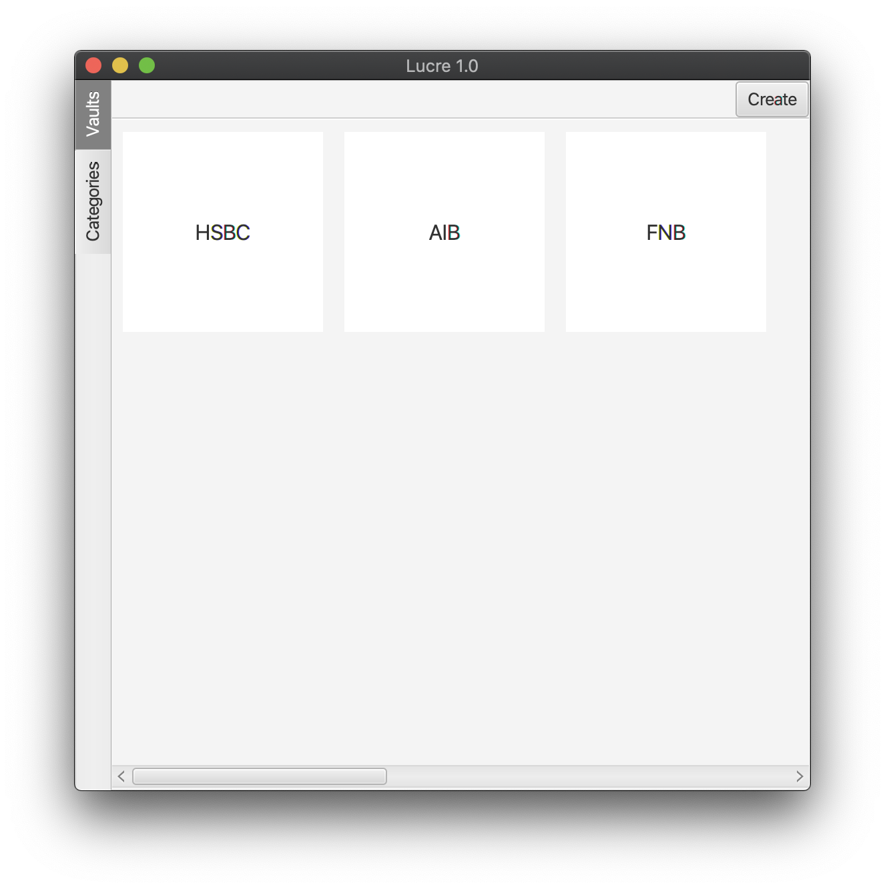
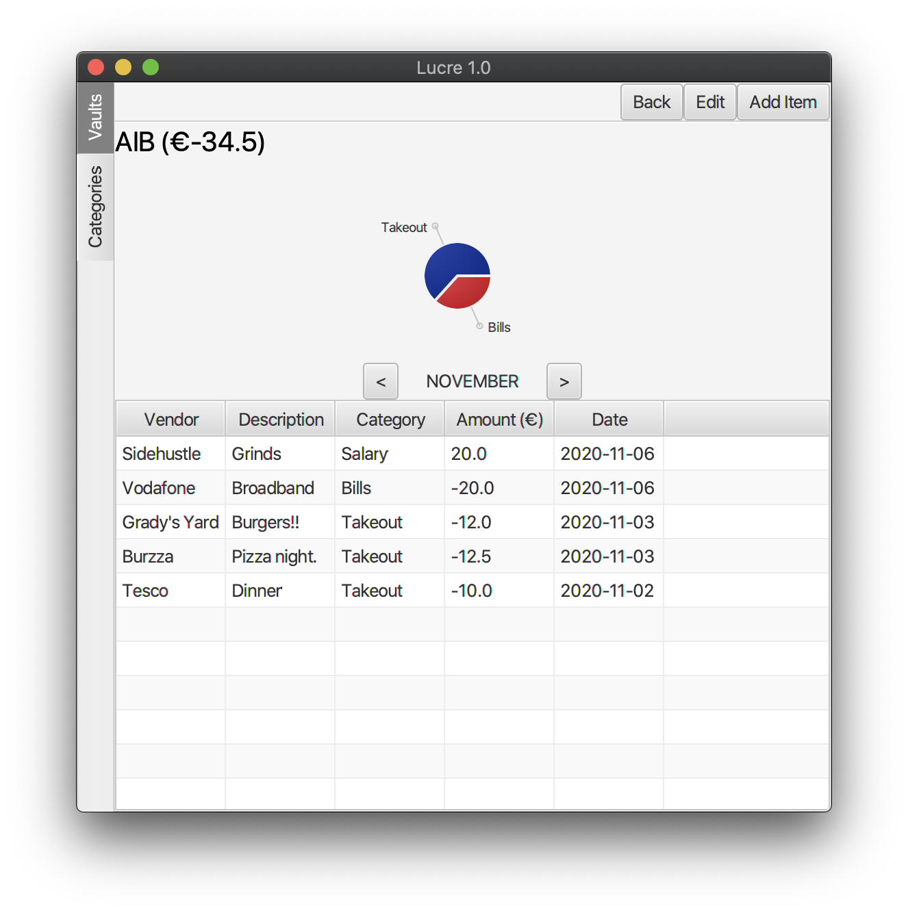
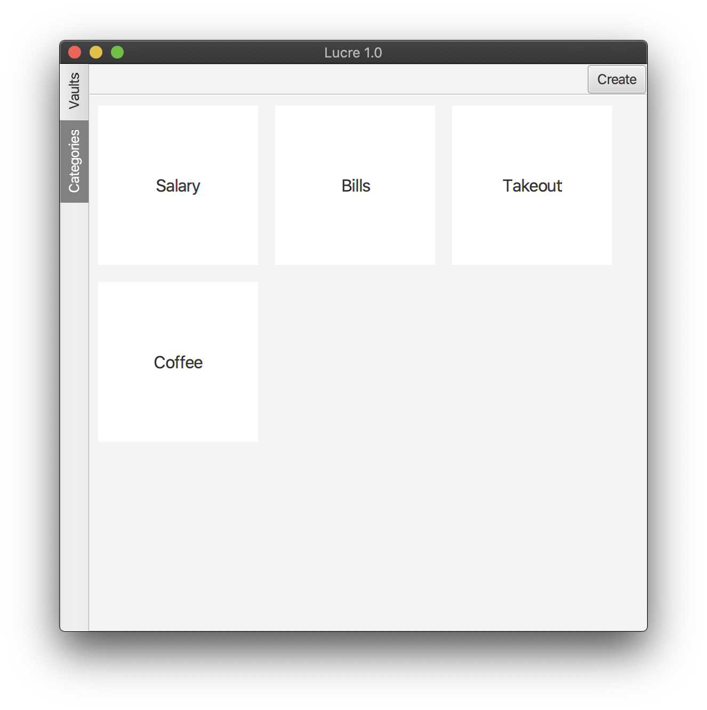
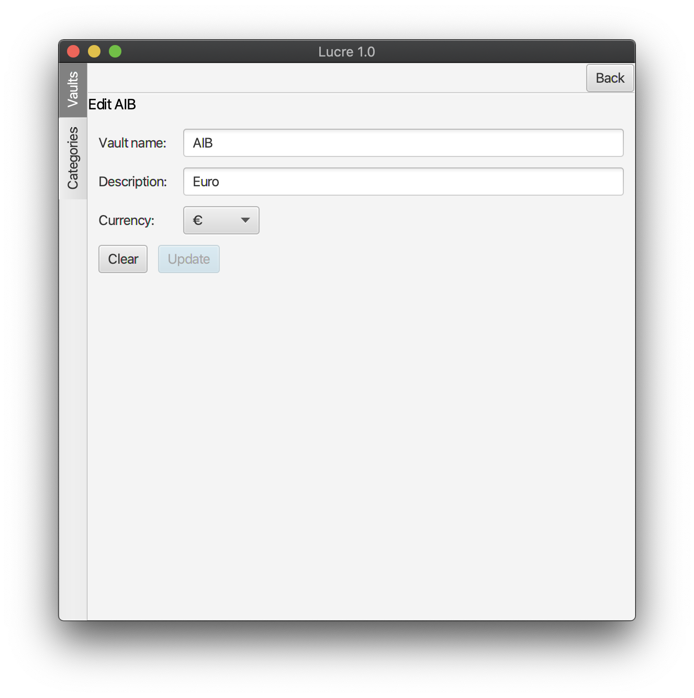

# Lucre Desktop
Mobile App Development - First Assignment

https://www.youtube.com/watch?v=JjCyPoT6Wdw&feature=youtu.be

Lucre is a desktop app for keeping track of your income
and expenses. The app has the ability to split your spending
into different categories. The app allows for the use of mutliple
accounts with support for various currencies. Lucre is a desktop app built in Kotlin and leverages TornadoFx for the GUI.

## Account/Vault View

The main view opens up to show a list of your accounts.
From the main menu you can double click on an item to open it up.
Or you can right click to edit or delete the item. You can also create
a new vault by clicking on the button in the top right.

### Viewing an account

Double clicking on an account will take you to the vault view page.
You can see your income and expenses listed by date with a helpful
chart that shows your expenses by category. The view page also
shows the balance for the current month. You can click on the arrows
to view different months in the year. 

The menu in the top right gives you the ability to go back, edit
the current vault or add an income or expense to the vault.

To edit or delete an entry, you can right click on the item in the list in this view.

## Category View

Similar to the vault view, you can double click on an item to view it.
Alternatively, you can right click for a context menu which will give you 
the ability to edit or delete the desired category. Clicking on the `create`
button will allow you to create a new category.

## Validation built in

All add and edit views are built on TornadoFx's ViewModels. The form
will only allow you to submit once all the required fileds are filled in. Or, in the case of
an update or edit view, you will only be able to click the update button if 
there are changes to the field inputs. You will always be prompted before deleting an entry, vault or category.

